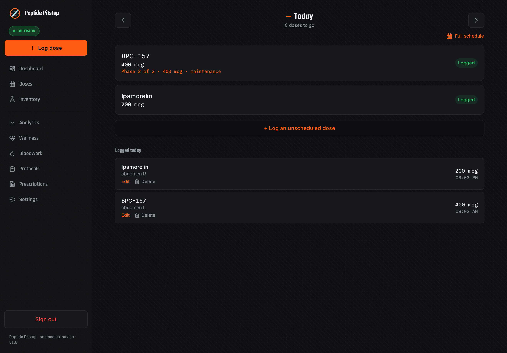
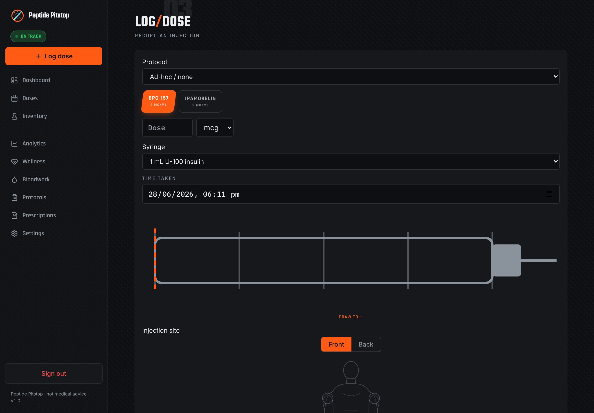
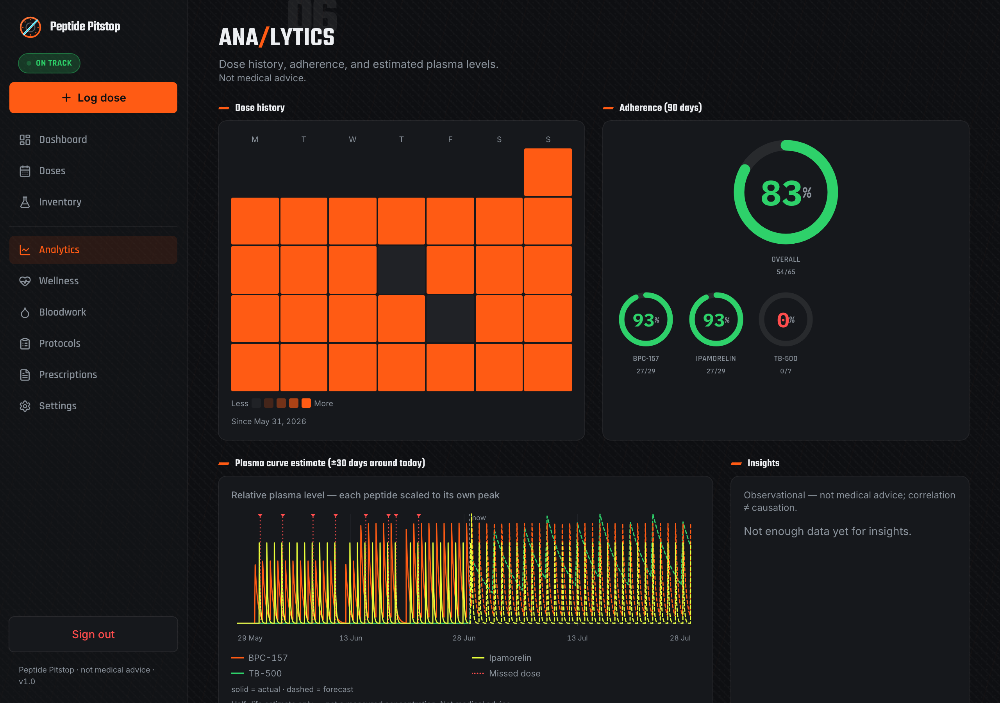
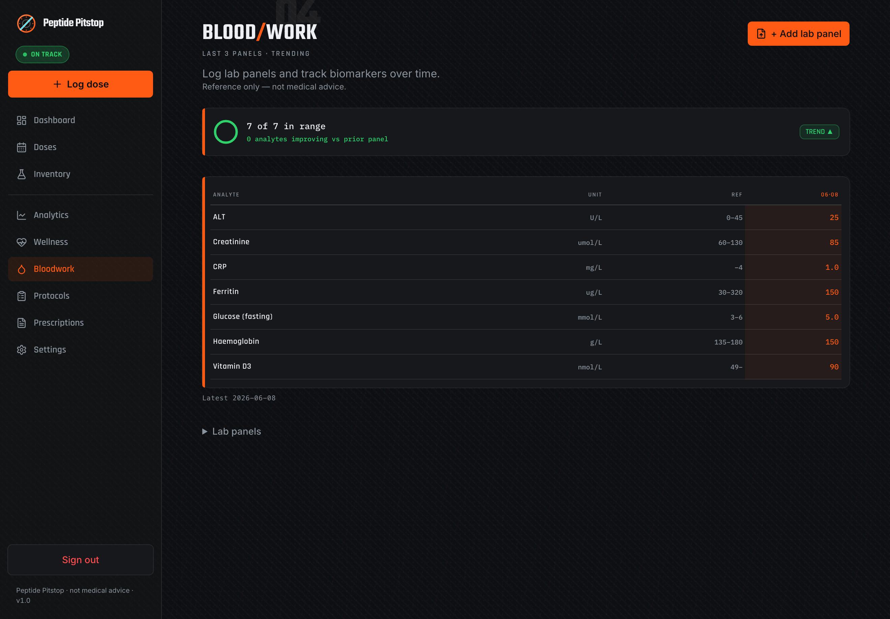
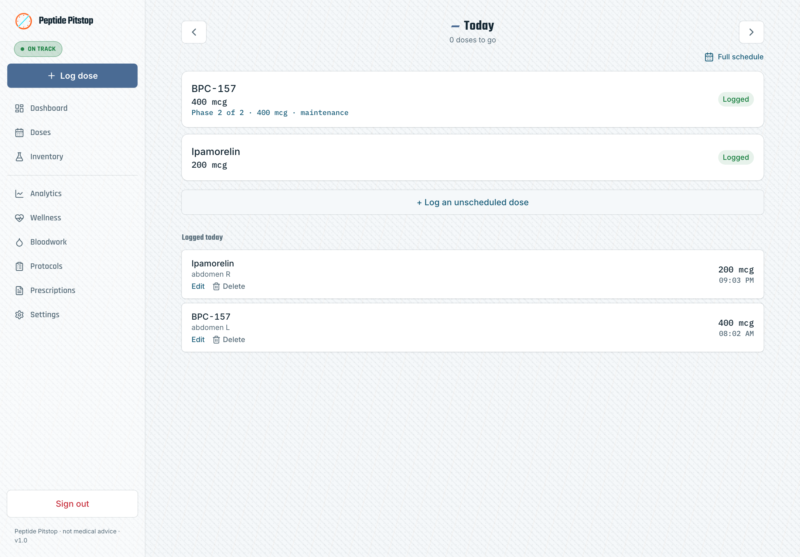
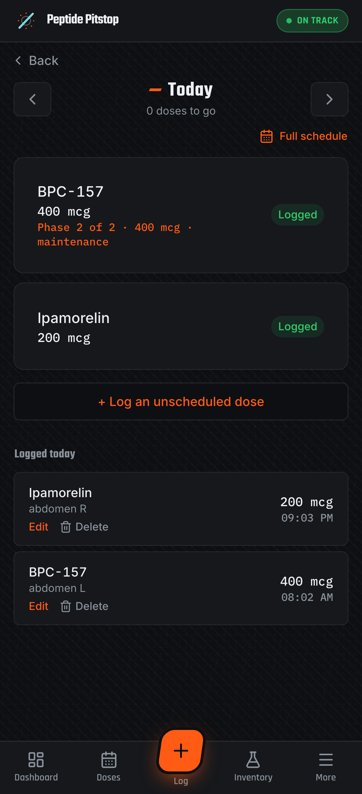
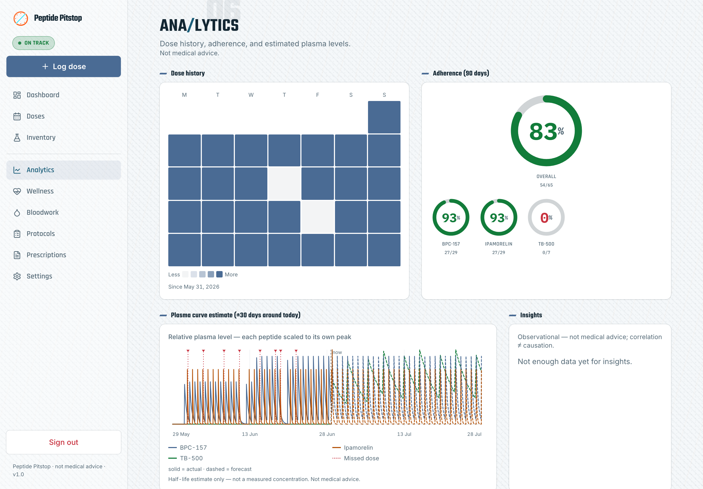
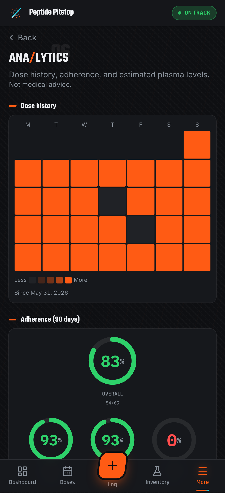

# Peptide Pitstop

[](LICENSE)
[](https://nextjs.org/)
[](https://www.typescriptlang.org/)
[](https://www.prisma.io/)
[](https://tailwindcss.com/)
[](https://web.dev/progressive-web-apps/)
[](https://buymeacoffee.com/peptidepitstop)

**Self-hosted peptide therapy tracking that runs on your hardware, under your control.**

> **Your data never leaves your server.** Handing your weight, hormone, and dosing history to someone else's startup is a leap of faith — Peptide Pitstop removes the leap. No accounts in someone else's cloud. No telemetry. No third party between you and your health record. You host it, you back it up, you export it, you delete it — on your terms.

Peptide Pitstop is a private, phone-first web app for managing peptide and GLP-1 therapy — reconstitution math, dose logging, prescriptions, bloodwork, and plasma-level modelling — installable as an offline PWA and living entirely on infrastructure you own. The dosing engine, the highest-stakes part, is exhaustively tested (600+ tests, pure decimal math, no floating-point drift).

> ℹ️ Single-user today, with the data model already scoped for multi-user.

---

## 📑 Table of Contents

- [🔒 Own your own data](#-own-your-own-data)
- [📸 Screenshots](#-screenshots)
- [✨ Features](#-features)
- [🧱 Stack](#-stack)
- [✅ Prerequisites](#-prerequisites)
- [🚀 Quickstart (local dev)](#-quickstart-local-dev)
- [🐳 Deploy (self-hosted)](#-deploy-self-hosted)
- [🔐 Locked out?](#-locked-out)
- [📚 Further documentation](#-further-documentation)
- [🛠️ Project status & contributing](#️-project-status--contributing)
- [☕ Support](#-support)
- [📄 License](#-license)
- [⚠️ Disclaimer](#-disclaimer)

---

## 🔒 Own your own data

This is the whole point. Health data this sensitive shouldn't live in a vendor's database you can't see.

- **Runs on your own machine.** A single Docker container on your own server (built and tested on Unraid). No SaaS, no managed backend, no account on a service that can change its terms, get breached, or shut down.
- **Local-only accounts.** There is no public sign-up. The owner provisions the account locally; first run forces a `/setup` flow to set a password and enrol TOTP. Login requires **password + TOTP**, with signed httpOnly session cookies.
- **Encryption in depth.** Identifying free-text and lab values are encrypted at the application layer with **AES-256-GCM** before they ever touch disk; the database file itself sits on your encrypted pool. Encrypted columns are opaque — they're never used in query filters.
- **No tracking, no analytics SDKs, no CDN.** There is no Google Analytics, Sentry, PostHog, or any usage telemetry — nothing reports your behaviour to anyone. The app's analytics are computed locally from your database, and fonts are **self-hosted** (served from your own server, not Google Fonts or any CDN). The only outbound traffic is the services *you* configure — your Cloudflare Tunnel, your Home Assistant webhook, your Garmin sync — plus an optional dosage-reference lookup that runs **only when you explicitly trigger it**.
- **You hold the backups.** Continuous SQLite replication via [Litestream](https://litestream.io/) to a backup location you own — plus your normal server backup routine.
- **Export everything, any time.** One-click CSV export for doses, lab panels, journal entries, and wearable data, plus a formatted PDF report. Your record is portable by design — never locked in.
- **No open ports, no public surface.** Reach it from your phone anywhere via your own Cloudflare Tunnel + Cloudflare Access policy — nothing is exposed to the open internet.

If you stop using Peptide Pitstop tomorrow, you walk away with a complete, readable copy of your data and an encryption key only you hold. That's the deal.

---

## 📸 Screenshots

> All screenshots use demo seed data only (BPC-157, TB-500, Ipamorelin) — no real personal data.

**Today** — what's due and what's been logged, with one-tap actions


**Log a dose** — draw volume, syringe markings, and an injection-site map


**Analytics & plasma** — adherence, a dose-history heatmap, and plasma-level estimates


**Bloodwork** — biomarker panels, an in-range summary, and the comparison matrix


### Light theme & mobile

The motorsport "pit-wall" dark theme ships alongside a clean light theme, and the whole app is phone-first.

| Light theme (Gulf) | On your phone |
| --- | --- |
|  |  |
|  |  |

---

## ✨ Features

### Dosing — the safety-critical core
- **Reconstitution engine.** Concentration, draw volume, and syringe markings computed with `decimal.js` — pure decimal maths, no floating-point drift. Handles reconstituted *and* premixed vials.
- **Exhaustively tested.** The dosing and schedule logic is covered by a large vitest suite (600+ tests across the codebase) including property tests, real-world cases, unit-equivalence checks, and syringe-bound guardrails.
- **Phone-first logging.** Log a dose in seconds with a visual syringe picker and injection-site body map. Supports injections, oral peptides, and ad-hoc doses.

### Protocols, prescriptions & inventory
- **Protocols with titration & stacks.** Multi-peptide schedules, ramping/titration steps, and stacked protocols with human-readable cadence and half-life shown inline.
- **Prescriptions & vials.** Full CRUD for prescriptions, vials, and preparations, with per-dose vial-volume accounting.
- **Inventory & reorder.** Depletion forecasting (doses remaining / days of supply) and lead-time-aware reorder status so you restock before you run dry.

### Tracking & insight
- **Today.** A single screen of what's due and what's been logged today, with one-tap actions.
- **Doses timeline.** Week swimlanes, a month calendar, and day detail — with schedule rebasing (log off-schedule and snap the rest of the week back into line).
- **Bloodwork.** Biomarker panels with trends and a comparison matrix, backed by a curated biomarker library.
- **Analytics & insights.** Adherence tracking, streaks, heatmaps, and derived insights.
- **Plasma modelling.** Single-compartment, first-order-elimination plasma-level projections from your dose history and each peptide's half-life (relative units — clearly labelled, not clinical serum levels).
- **Journal & wellness.** Free-text journal plus wellness logging, charted over time.

### Integrations
- **Home Assistant reminders.** Dose reminders pushed via a Home Assistant webhook to your phone — free, no third-party notification service.
- **Garmin wellness.** A bundled sync sidecar pulls daily Garmin wellness data (steps, sleep, etc.) into the app using your own credentials, on your own schedule.
- **Curated peptide library + enrichment.** Built-in peptide reference data with an enrichment calculator.

### Experience
- **Installable PWA.** Add to your home screen; works offline for the things that matter on the go.
- **Pit-wall design language.** A motorsport-inspired "Peptide Pitstop" theme (carbon + race-orange, radial gauges, split headings) — switchable via a single `DESIGN` env var, with the original clean theme byte-identical when unset.

---

## 🧱 Stack

Next.js (App Router) · TypeScript · Tailwind + design tokens · Prisma + SQLite · `decimal.js` dosing engine · `otplib` TOTP + `jose` sessions · Litestream backup · Docker + Cloudflare Tunnel.

The production deployment runs as **one container** bundling four services — the Next.js app, the Cloudflare tunnel, Litestream backup, and the Garmin sync sidecar — talking to each other over localhost.

---

## ✅ Prerequisites

- **Node.js 22** and npm (for local development).
- **Docker + Docker Compose** (for self-hosting).
- A **Cloudflare account** with Zero Trust enabled (for secure external access — optional if you only run it on your LAN).

---

## 🚀 Quickstart (local dev)

```bash
npm install
cp .env.example .env        # then fill PT_FIELD_KEY and AUTH_SECRET
npx prisma migrate dev --name init
npm run db:seed             # optional: loads a sample regimen
npm run dev                 # http://localhost:3009
```

Generate the two required secrets:

```bash
node -e "console.log(require('crypto').randomBytes(32).toString('base64'))"   # PT_FIELD_KEY
node -e "console.log(require('crypto').randomBytes(32).toString('base64'))"   # AUTH_SECRET
```

On first visit, `/setup` walks you through setting a password and enrolling TOTP.

### Tests

```bash
npm test          # vitest — dosing engine, schedule, analytics, auth, …
npm run typecheck
```

---

## 🐳 Deploy (self-hosted)

Two compose variants ship in this repo:

**1. App + tunnel** (the default `docker-compose.yml`) — the Next.js app plus a Cloudflare tunnel:

```bash
# On your server, in this directory, with a populated .env:
docker compose up -d --build
```

- The app runs internally only — **no host ports are published**.
- `cloudflared` exposes it via your own Cloudflare Tunnel token.
- Your SQLite database lives on a volume you control (keep it on an encrypted pool).

**2. Bundled production** (`deploy/bundled/`) — one container running all four services: the app, the Cloudflare tunnel, **Litestream backup**, and the **Garmin sync** sidecar, talking to each other over localhost. This is the full-featured production setup; Litestream replication and Garmin sync live here, not in the minimal variant above. See `deploy/bundled/cutover.sh`.

### Cloudflare Tunnel + Access

1. Cloudflare Zero Trust → **Networks → Tunnels** → create a tunnel; put its token in `CLOUDFLARE_TUNNEL_TOKEN`.
2. Public hostname → `http://app:3000`.
3. **Access → Applications** → protect the hostname; policy = allow your email (one-time PIN) or your IdP.

### Configuration

| Variable | Purpose |
|---|---|
| `PT_FIELD_KEY` | 32-byte base64 key for AES-256-GCM field encryption |
| `AUTH_SECRET` | Session signing secret |
| `DATABASE_URL` | SQLite path (maps to your appdata volume) |
| `HA_WEBHOOK_URL` | Home Assistant webhook for dose reminders |
| `WELLNESS_IMPORT_TOKEN` | Bearer token the Garmin sidecar presents (fails closed if unset) |
| `CLOUDFLARE_TUNNEL_TOKEN` | Your Cloudflare Tunnel token |
| `GARMIN_EMAIL` / `GARMIN_PASSWORD` | Consumed only by the Garmin sync sidecar |
| `DESIGN` | UI theme pack (`pitstop`, or unset for the original theme) |

See `.env.example` for the full, commented list.

---

## 🔐 Locked out?

Single owner, no recovery email by design. Re-provision by clearing the password directly in the DB, then revisit `/setup`:

```bash
sqlite3 /path/to/peptides.db \
  "UPDATE User SET passwordHash='', totpSecret=NULL WHERE role='owner';"
```

---

## 📚 Further documentation

- [Home Assistant dose-reminder automation](docs/ha-reminder-automation.md) — wiring the reminder webhook to Companion push.

> Apple Health is intentionally **not** a built-in integration: HealthKit is device-only and a self-hosted web app cannot write to it. See [the Shortcut workaround](docs/apple-health-shortcut.md) if you want a manual bridge.

---

## 🛠️ Project status & contributing

Peptide Pitstop is an actively developed, single-owner self-hosted project. Issues and discussion are welcome — please open an issue before submitting a large PR, as contributions may require a contributor agreement (see [License](#-license) below).

---

## ☕ Support

Peptide Pitstop is built and maintained by one person, for people who'd rather keep their health data on their own hardware than hand it to someone else's cloud (Yes, slightly hypocritical with the garmin pull). It's free, open source, and always will be.

If it's saved you from a spreadsheet — or from a subscription that wanted your bloodwork — a coffee goes a long way toward keeping an indie, self-hosted health tool alive and improving.

[](https://buymeacoffee.com/peptidepitstop)

No pressure, and no paywalled features — every line of code stays open. Thank you. ☕

---

## 📄 License

[GNU AGPL-3.0](LICENSE). You're free to self-host, study, modify, and redistribute — but if you run a modified version as a network service, you must make your source available under the same license. Copyright is retained by the project owner.

---

## ⚠️ Disclaimer

Peptide Pitstop is a **personal tracking tool, not a medical device** and not a substitute for professional medical advice. It does not diagnose, treat, or make dosing recommendations. You are responsible for your own therapy decisions. Dosing maths is provided to help you record and check your own calculations — always verify independently.
