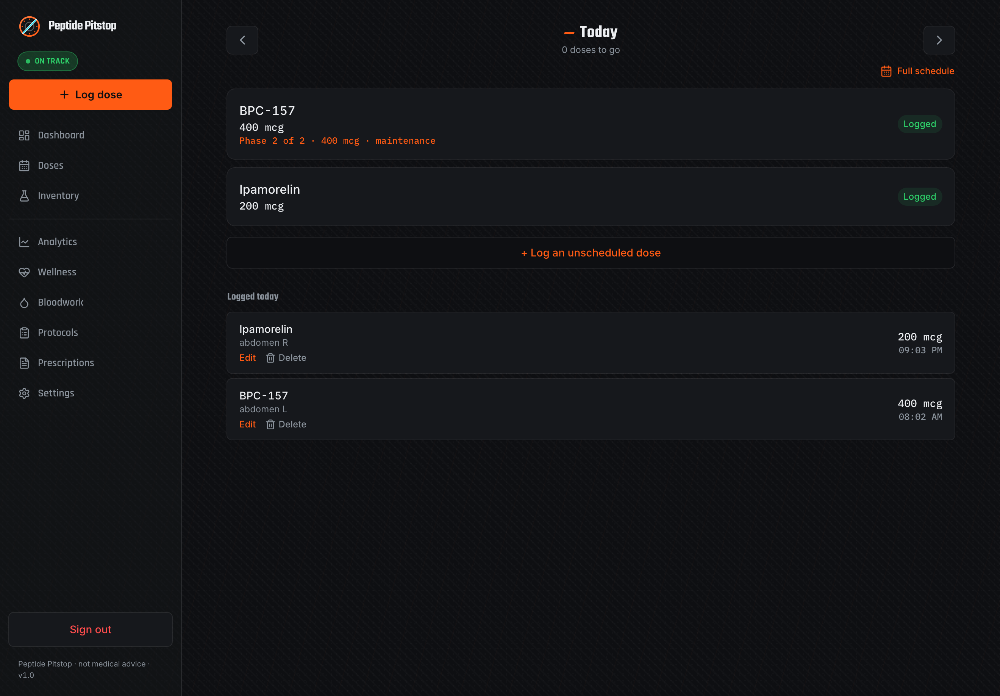
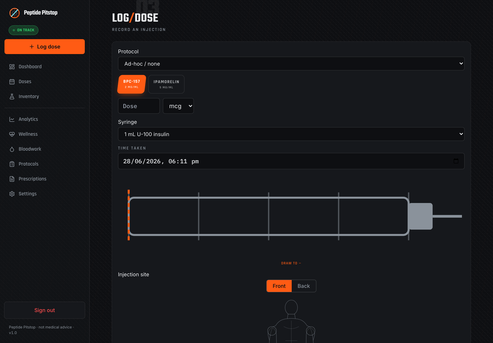
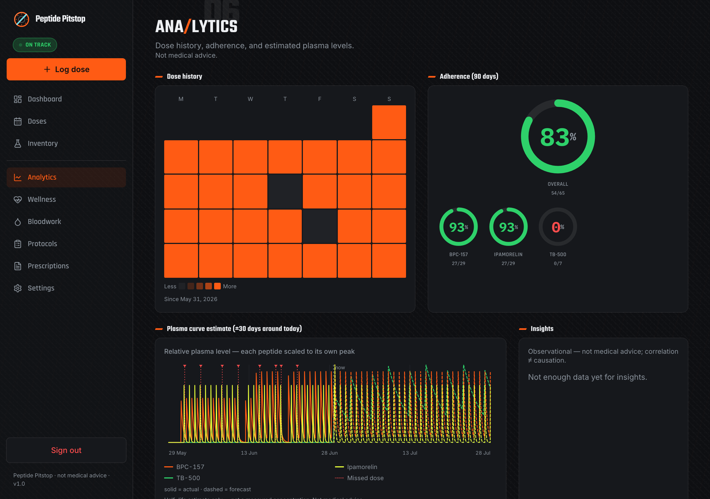
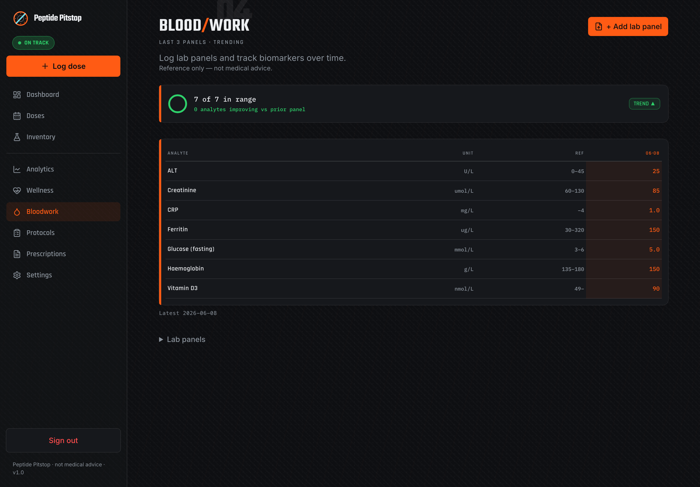
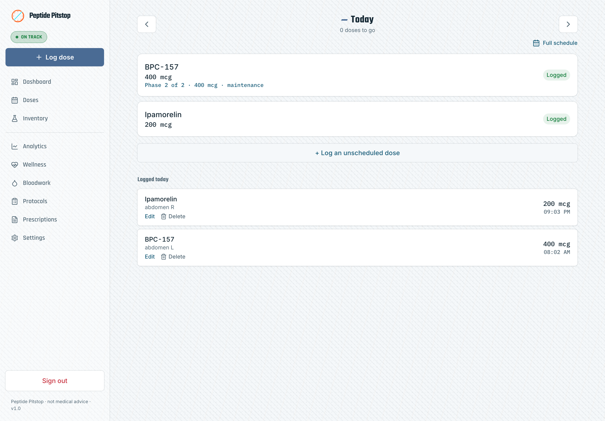
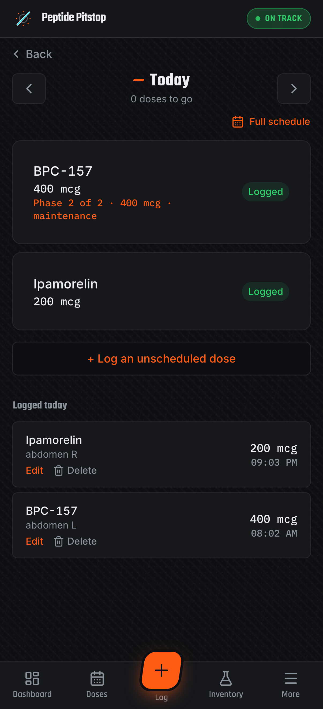
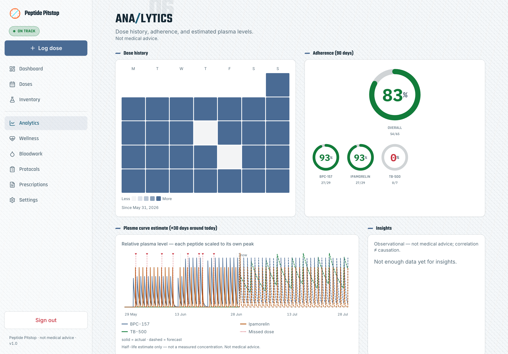
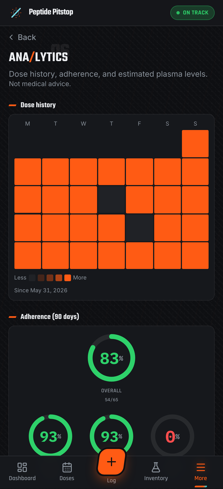

# Peptide Pitstop

[](LICENSE)
[](https://nextjs.org/)
[](https://www.typescriptlang.org/)
[](https://www.prisma.io/)
[](https://tailwindcss.com/)
[](https://web.dev/progressive-web-apps/)
[](https://buymeacoffee.com/peptidepitstop)

**Self-hosted peptide therapy tracking that runs on your hardware, under your control.**

> **Your data never leaves your server.** Handing your weight, hormone, and dosing history to someone else's startup is a leap of faith — Peptide Pitstop removes the leap. No accounts in someone else's cloud. No telemetry. No third party between you and your health record. You host it, you back it up, you export it, you delete it — on your terms.

Peptide Pitstop is a private, self-hosted web app for managing peptide and GLP-1 therapy — reconstitution math, dose logging, prescriptions, bloodwork, and plasma-level modelling — installable as an offline PWA on your phone and living entirely on infrastructure you own. The dosing engine, the highest-stakes part, is exhaustively tested — pure decimal math, no floating-point drift.

> ℹ️ Single-user today, with the data model already scoped for multi-user.

---

## 📑 Table of Contents

- [🔒 Own your own data](#-own-your-own-data)
- [📸 Screenshots](#-screenshots)
- [✨ Features](#-features)
- [🧱 Stack](#-stack)
- [✅ Prerequisites](#-prerequisites)
- [🚀 Quickstart (local dev)](#-quickstart-local-dev)
- [🐳 Deploy (self-hosted)](#-deploy-self-hosted)
- [🔔 Push notifications](#-push-notifications)
- [🔐 Locked out?](#-locked-out)
- [📚 Further documentation](#-further-documentation)
- [🛠️ Project status & contributing](#️-project-status--contributing)
- [☕ Support](#-support)
- [📄 License](#-license)
- [⚠️ Disclaimer](#-disclaimer)

---

## 🔒 Own your own data

This is the whole point. Health data this sensitive shouldn't live in a vendor's database you can't see.

- **Runs on your own machine.** A single Docker container on your own server (any Docker host — Linux, NAS, Raspberry Pi, etc.). No SaaS, no managed backend, no account on a service that can change its terms, get breached, or shut down.
- **Local-only accounts.** There is no public sign-up. The owner provisions the account locally; first run forces a `/setup` flow to set a password and enrol TOTP. Login requires **password + TOTP**, with signed httpOnly session cookies.
- **Encryption in depth.** Identifying free-text and lab values are encrypted at the application layer with **AES-256-GCM** before they ever touch disk; ideally the database file itself sits on an encrypted disk too. Encrypted columns are opaque — they're never used in query filters.
- **No tracking, no analytics SDKs, no CDN.** There is no Google Analytics, Sentry, PostHog, or any usage telemetry — nothing reports your behaviour to anyone. The app's analytics are computed locally from your database, and fonts are **self-hosted** (served from your own server, not Google Fonts or any CDN). The only outbound traffic is the services *you* configure — your Cloudflare Tunnel, your Home Assistant webhook, your Garmin sync — plus an optional dosage-reference lookup that runs **only when you explicitly trigger it**.
- **You hold the backups.** Continuous SQLite replication via [Litestream](https://litestream.io/) to a backup location you own — plus your normal server backup routine.
- **Export everything, any time.** One-click CSV export for doses, lab panels, journal entries, and wearable data, plus a formatted PDF report. Your record is portable by design — never locked in.
- **No open ports, no public surface.** Reach it from your phone anywhere via your own Cloudflare Tunnel + Cloudflare Access policy — nothing is exposed to the open internet.

If you stop using Peptide Pitstop tomorrow, you walk away with a complete, readable copy of your data and an encryption key only you hold. That's the deal.

---

## 📸 Screenshots

> All screenshots use demo seed data only (BPC-157, TB-500, Ipamorelin) — no real personal data.

**Today** — what's due and what's been logged, with one-tap actions


**Log a dose** — draw volume, syringe markings, and an injection-site map


**Analytics & plasma** — adherence, a dose-history heatmap, and plasma-level estimates


**Bloodwork** — biomarker panels, an in-range summary, and the comparison matrix


### Light theme & mobile

The motorsport "pit-wall" dark theme ships alongside a clean light theme, and the whole app is self-hosted on your hardware — and on your phone.

| Light theme (Gulf) | On your phone |
| --- | --- |
|  |  |
|  |  |

---

## ✨ Features

### Dosing — the safety-critical core
- **Reconstitution engine.** Concentration, draw volume, and syringe markings computed with `decimal.js` — pure decimal maths, no floating-point drift. Handles reconstituted *and* premixed vials.
- **Exhaustively tested.** The dosing and schedule logic is covered by an extensive vitest suite including property tests, real-world regression cases, unit-equivalence checks, and syringe-bound guardrails.
- **Quick logging.** Log a dose in seconds — on your phone — with a visual syringe picker and injection-site body map. Supports injections, oral peptides, and ad-hoc doses.
- **Syringes and pens.** A device can be a barrel syringe or a dial-a-dose pen. Pens get a dose-window graphic and pen wording instead of a drawn barrel — presentation only, never a change to the dose maths. Set one device as your default and it is preselected wherever a protocol hasn't pinned its own.

### Protocols, prescriptions & inventory
- **Protocols with titration & stacks.** Multi-peptide schedules, ramping/titration steps, and stacked protocols with human-readable cadence and half-life shown inline. Protocols are grouped by lifecycle — active, scheduled to start later, paused, past their end date, and completed — so a protocol queued for next month never sits indistinguishable from one running today.
- **Revise a protocol instead of editing it.** Changing a live protocol's dosing schedule — 4× weekly to daily, or the shape of a titration ramp — completes the current course and starts a linked replacement, rather than rewriting the one your doses were logged against. The replacement resumes at the dose you are actually on, with the rest of the ladder carried across and editable before you confirm; your logged doses stay with the protocol they were taken under, and the two are linked as one course so adherence doesn't reset. Editing in place is refused, because it silently re-times every step: step lengths are stored in days but the ladder advances on a dose count derived from your injection frequency, so changing that frequency re-derives every past step's target and moves you up or down your own ramp with no warning.
- **Cycle planning.** Give a protocol a course-level on/off plan in weeks — run for eight, break for four — and the app tracks where you are in it: a day-of-cycle chip on the list, a banner as the planned last dose approaches and once a break is over, and notifications on the same exactly-once ledger as dose reminders. Distinct from an intra-week dosing rhythm: this governs whether the protocol should be running at all. The suggested length is drawn from the peptide's own literature and shown with its source quote, as reference only.
- **Titration inside a stack.** A stack's components can each carry their own ramp, built at creation time and optionally moved in lockstep. Every stack surface resolves the dose you are actually on rather than the protocol's headline target, and schedule rewrites are refused on a stack that is mid-ladder — the same guard that protects a standalone protocol.
- **Gantt view.** A timeline of concurrent courses, with cycle boundaries and end dates editable in place, for seeing how overlapping protocols actually line up.
- **Prescriptions & vials.** Full CRUD for prescriptions, vials, and preparations, with per-dose vial-volume accounting.
- **Guided prescription wizard (opt-in).** A step-by-step flow for entering a prescription and its protocol, reachable from Prescriptions. Off by default — set `ENABLE_PRESCRIPTION_WIZARD=1` to switch it on.
- **Inventory & reorder.** Depletion forecasting (doses remaining / days of supply) and lead-time-aware reorder status so you restock before you run dry. A repeating course projects its next on-cycle as provisional demand, so the reorder date keys to the restart rather than going quiet through the off-weeks and flipping to *order now* after the shipping window has closed.

### Cost tracking
- **Landed cost, not sticker price.** Shipping, tax, fees and discounts belong to the *order*, not to any one item, so they are recorded once on the invoice and shared across its lines — pro-rata by value, equally per unit, or left unallocated. The split is exact: the rounding residual lands on the largest line, so three lines sharing $10 still sum to $10.00 and the invoice reconciles.
- **One line can cover several vials.** A "3 × 10mg" line divides its landed cost across all three, so every vial carries its honest share of the courier fee whether or not you have created all three vial records yet.
- **Cost per dose, by delivered mass.** Not invoice ÷ dose count — that goes wrong the moment a vial is half-used or a titration changes the dose. Each vial gets a cost per mcg, and every logged dose is charged its own mass. Stays correct through partial vials and dose ramps.
- **Consumables counted in.** Needles, syringes, swabs, sharps containers, pen tips and bacteriostatic water are invoice lines too, with pack sizes and an optional units-per-dose. Declare the usage and you get a modelled per-injection cost; leave it blank and the spend amortises instead of inventing a burn rate.
- **Wasted product, quantified.** Mass never delivered from a finished or discarded vial is valued and reported separately, so it never quietly inflates the cost of the doses you actually took. Vials that delivered more than 70% are not counted — ordinary end-of-vial residue is not waste, and treating it as such buries the losses that matter.
- **Honest about what it does not know.** A vial with no invoice line is *uncosted*, never free: its doses are excluded from the averages and the screen tells you how many. A peptide you have not invoiced shows "—", not "$0.00". A prescription's recorded cost fills the gap only when no invoice is matched, so the same money is never counted twice. Mixed currencies warn rather than inventing a conversion rate.

### Tracking & insight
- **Today.** A single screen of what's due and what's been logged today, with one-tap actions. Stays live on its own: the view refreshes when the app returns to the foreground, at the phone-local 02:00 tracking-day boundary, and when your device's timezone changes.
- **Doses timeline.** Week swimlanes, a month calendar, and day detail — with schedule rebasing (log off-schedule and snap the rest of the week back into line) and catch-up rolling for interval protocols.
- **Timezones & travel.** “Log now” stores the server's authoritative UTC instant while the UI renders the logging phone's local time. Every dose freezes its phone-local tracking day and timezone; 00:00–01:59 remains on the preceding tracking day and 02:00 starts the next one. Reminders and schedule slots stay anchored to the server's configured home timezone.
- **Bloodwork.** Biomarker panels with trends and a comparison matrix, backed by a curated biomarker library.
- **Analytics & insights.** Adherence tracking, streaks, heatmaps, and derived insights.
- **Plasma modelling.** Single-compartment, first-order-elimination plasma-level projections — quiet telemetry for your own regimen — from your dose history and each peptide's half-life (relative units — clearly labelled, not clinical serum levels). Blends whose composition is known are charted **per component**, each decaying on its own half-life, because a blend has no meaningful single half-life: KLOW's GHK-Cu clears in about an hour while its TB-500 persists for days. Anything with no half-life on record is named beneath the chart rather than silently omitted.
- **Blend composition.** Record what a vendor blend actually contains — each component and its mass in one labelled vial — and every dose of that blend is split into the compounds it delivers. Blend-delivered mass then aggregates with any standalone protocol for the same compound, so cumulative exposure stops understating itself and a component with no protocol of its own stops being invisible. The split is derived, never entered twice: it flows through the dose CSV, the doctor-report PDF, per-component cost, the cumulative-exposure table, the plasma chart, and the prospective split shown on Today and in the log form. Components carry their provenance (label, CoA, or assumed) and every derived figure is badged as derived. Two compounds that share a family name stay separate identities, so neither inherits the other's exposure.
- **Journal & wellness.** Free-text journal plus wellness logging, charted over time.
- **Body composition.** Record whole-body DEXA scans (totals, eight regions, VAT, BMD, prep conditions) and resting-metabolic-rate tests, or upload a Hologic report PDF and confirm the parsed values. Changes between scans are judged against the scanner's least-significant-change bands, so a 0.3 kg lean-mass move is called *within noise* rather than a result. A regional body figure lights bone, lean and fat per region; illness and travel windows shade the series and are excluded from intervals; both tables export to CSV and appear in the doctor report.

### Integrations
- **Push dose reminders.** Native Web Push notifications from the installed PWA — per-slot reminders for multi-time schedules plus a configurable evening catch-up nag; tapping opens the app (iOS 16.4+). Optional Home Assistant webhook fallback for devices without a subscription. Free, no third-party notification service, and no dose amounts in the payload.
- **Garmin wellness & training.** A bundled sync sidecar pulls daily Garmin wellness data (steps, sleep, resting HR, HRV) and, on watches that report them, the training metrics — readiness, acute:chronic load ratio, endurance and hill scores, fitness age, lactate threshold — into the app using your own credentials, on your own schedule. A Training card charts them beside the wellness series.
- **Garmin ECG import.** Drop the PDF that the Garmin ECG app exports onto the journal page and the app reads the classification, heart rate and the traced waveform, then draws the strips in the app. It deliberately skips the patient name and date of birth printed on the report; clinical fields are encrypted at rest.
- **Curated peptide library + enrichment.** Built-in peptide reference data with an enrichment calculator.

### Experience
- **Installable PWA.** Add to your home screen; works offline for the things that matter on the go.
- **Pit-wall design language.** A motorsport-inspired theme — carbon + race-orange, radial gauges, split headings — with light and dark modes.

---

## 🧱 Stack

Next.js (App Router) · TypeScript · Tailwind + design tokens · Prisma + SQLite · `decimal.js` dosing engine · `otplib` TOTP + `jose` sessions · Litestream backup · Docker + Cloudflare Tunnel.

The production deployment runs as **one container** bundling four services — the Next.js app, the Cloudflare tunnel, Litestream backup, and the Garmin sync sidecar — talking to each other over localhost.

---

## ✅ Prerequisites

- **Node.js 22** and npm (for local development).
- **Docker + Docker Compose** (for self-hosting).
- A **Cloudflare account** with Zero Trust enabled (for secure external access — optional if you only run it on your LAN).

---

## 🚀 Quickstart (local dev)

```bash
npm install
cp .env.example .env        # then fill PT_FIELD_KEY and AUTH_SECRET
npx prisma migrate dev --name init
npm run db:seed             # optional: loads a sample regimen
npm run dev                 # http://localhost:3009
```

Generate the two required secrets:

```bash
node -e "console.log(require('crypto').randomBytes(32).toString('base64'))"   # PT_FIELD_KEY
node -e "console.log(require('crypto').randomBytes(32).toString('base64'))"   # AUTH_SECRET
```

On first visit, `/setup` walks you through setting a password and enrolling TOTP.

### Tests

```bash
npm test          # vitest — dosing engine, schedule, analytics, auth, …
npm run typecheck
```

1452 tests across 127 files, plus a TypeScript typecheck, run against every release.

---

## 🐳 Deploy (self-hosted)

### Easiest — prebuilt image (recommended, no building)

You only need **Docker**: install [Docker Desktop](https://www.docker.com/products/docker-desktop/) on Mac/Windows (a normal point-and-click installer) or Docker Engine on Linux. Then:

1. **Make a folder** for the app (e.g. `peptide-pitstop`) and open a terminal in it.
2. **Generate the two required secrets** — run each command and copy the output:
   ```bash
   # macOS / Linux / Git Bash — run twice
   openssl rand -base64 32
   ```
   ```powershell
   # Windows PowerShell — run twice
   $b = New-Object byte[] 32; [Security.Cryptography.RandomNumberGenerator]::Create().GetBytes($b); [Convert]::ToBase64String($b)
   ```
3. **Create a file named `docker-compose.yml`** in that folder, pasting your two secrets in:
   ```yaml
   services:
     app:
       image: ghcr.io/kavo91/peptide-pitstop:latest
       container_name: peptide-pitstop
       restart: unless-stopped
       ports:
         - "3000:3000"
       volumes:
         - ./data:/data        # your database lives here — back this folder up
       environment:
         - PT_FIELD_KEY=paste-your-first-secret-here
         - AUTH_SECRET=paste-your-second-secret-here
   ```
4. **Start it:**
   ```bash
   docker compose up -d
   ```
5. **Open [http://localhost:3000](http://localhost:3000)** — the first visit runs a `/setup` wizard (set a password + scan a QR code into an authenticator app).

Update later with `docker compose pull && docker compose up -d`. ⚠️ Keep `PT_FIELD_KEY` safe — if you lose it, encrypted fields can't be recovered.

> Want it reachable from your phone outside home? Add the optional Cloudflare Tunnel (see [Cloudflare Tunnel + Access](#cloudflare-tunnel--access) below) instead of forwarding ports.

### On a NAS (Unraid · CasaOS · Synology)

Ready-made templates live in [`deploy/`](deploy) — all use the prebuilt image, default to **port 3000** and a **dedicated app-data volume**, so they run happily alongside anything else on the box.

- **Unraid** — [`deploy/unraid/peptide-pitstop.xml`](deploy/unraid/peptide-pitstop.xml). Docker tab → **Add Container** → paste the template's raw URL, or install from **Community Applications** once it's listed. Maps `/data` to `/mnt/user/appdata/peptide-pitstop`.
- **CasaOS** — [`deploy/casaos/peptide-pitstop/docker-compose.yml`](deploy/casaos/peptide-pitstop/docker-compose.yml). App Store → **Custom Install** → import the compose (includes the `x-casaos` metadata so it shows an icon, description, and env prompts).
- **Synology** (DSM 7.2+) — [`deploy/synology/docker-compose.yml`](deploy/synology/docker-compose.yml) + a step-by-step [guide](deploy/synology/README.md). Container Manager → **Project** → create from the compose. Maps `/data` to `/volume1/docker/peptide-pitstop`.

In every case: set `PT_FIELD_KEY` and `AUTH_SECRET` before first start (`openssl rand -base64 32`), and if you browse over plain `http://<nas-ip>:3000` keep `COOKIE_SECURE=false`. First load runs the `/setup` wizard.

### Build from source

Prefer to build it yourself? Two compose variants ship in this repo:

**1. Simple** (the default `docker-compose.yml`) — just the Next.js app:

```bash
# On your server, in this directory, with a populated .env:
docker compose up -d --build
```

- Serves on **http://localhost:3000** by default.
- An optional Cloudflare Tunnel sidecar is included (commented out) to expose it publicly with no open ports — uncomment it and set `CLOUDFLARE_TUNNEL_TOKEN`.
- Your SQLite database lives in the `./data` volume you control (back it up; ideally keep it on an encrypted disk).

**2. All-in-one** (`deploy/bundled/`) — one "batteries-included" container running every service: the app, the Cloudflare tunnel, **Litestream backup**, and the **Garmin sync** sidecar, talking to each other over localhost. A supervisor starts them; the app is the critical process and the optional services (tunnel, Garmin) start only when their env is configured.

```bash
# Build + run the bundled image:
docker compose -f deploy/bundled/docker-compose.yml up -d --build
```

Set `TZ` to your home timezone (e.g. `TZ=America/New_York`) — it anchors schedule slots and reminders. Which day a dose is *filed under* no longer depends on it: each dose freezes its phone-local tracking day and timezone, with a 02:00 rollover, while elapsed-time calculations retain the authoritative UTC instant. If you use Garmin sync, make sure `./garmin-tokens` is owned by uid 1001 (the in-container user).

### Cloudflare Tunnel + Access

1. Cloudflare Zero Trust → **Networks → Tunnels** → create a tunnel; put its token in `CLOUDFLARE_TUNNEL_TOKEN`.
2. Public hostname → `http://app:3000`.
3. **Access → Applications** → protect the hostname; policy = allow your email (one-time PIN) or your IdP.

### Configuration

| Variable | Purpose |
|---|---|
| `PT_FIELD_KEY` | 32-byte base64 key for AES-256-GCM field encryption |
| `AUTH_SECRET` | Session signing secret |
| `DATABASE_URL` | SQLite path (maps to the `/data` volume) |
| `TZ` | Home timezone — anchors schedule slots and reminders (dose-day filing follows the phone-local 02:00 tracking-day boundary) |
| `OWNER_EMAIL` | Optional authenticator label for the first-run owner bootstrap (defaults to `owner@example.com`) |
| `VAPID_PUBLIC_KEY` / `VAPID_PRIVATE_KEY` / `VAPID_SUBJECT` | Web Push keys (`npx web-push generate-vapid-keys`) |
| `PUBLIC_APP_URL` | Absolute app URL used in relayed notification deep-links |
| `HA_WEBHOOK_URL` | Home Assistant webhook — fallback relay for dose reminders |
| `WELLNESS_IMPORT_TOKEN` | Bearer token the Garmin sidecar presents (fails closed if unset) |
| `ENABLE_PRESCRIPTION_WIZARD` | Set to `1` to enable the guided prescription wizard (off by default) |
| `CLOUDFLARE_TUNNEL_TOKEN` | Your Cloudflare Tunnel token |
| `GARMIN_EMAIL` / `GARMIN_PASSWORD` | Consumed only by the Garmin sync sidecar |

See `.env.example` for the full, commented list.

---

## 🔔 Push notifications

Dose reminders arrive as **native push notifications from the installed app** —
no third-party notification service, no account, nothing leaves your server
except the (amount-free) push payload. Tapping opens Peptide Pitstop directly.

What you get:

- **Per-slot reminders** — each scheduled time on a protocol reminds ±30 min
  around its own slot, including multi-time schedules (e.g. 08:00 + 20:00).
  Reminder times follow the server's `TZ` (your home zone), not the device —
  travelling doesn't shift when they fire.
- **Doses without a set time** remind once at your chosen hour (default 08:00).
- **Evening catch-up nag** — one summary of anything still unlogged (default
  18:00, or turn it off). Doses you've already logged never notify.
- **Exactly-once** — a claim ledger guarantees no double-sends, ever.

Setup (once per server):

```bash
npx web-push generate-vapid-keys
# Put the output in .env, then restart:
#   VAPID_PUBLIC_KEY=…  VAPID_PRIVATE_KEY=…  VAPID_SUBJECT=mailto:you@example.com
```

Then on each device: install the PWA (**iOS: Share → Add to Home Screen**,
iOS 16.4+), open it **from the home-screen icon**, and go to
**Settings → Notifications → Enable on this device → Send test**. Reminder
times and the nag toggle live in the same place.

Notes:

- Web Push needs HTTPS (a Cloudflare Tunnel works fine).
- Use a **separate VAPID keypair per environment** — push services authorise
  by key, not domain, so a staging box holding your production key and a
  copied database will push to your real phone.
- Run Home Assistant? An optional webhook relay covers devices without a
  subscription — see [docs/ha-reminder-automation.md](docs/ha-reminder-automation.md).

---

## 🔐 Locked out?

Single owner, no recovery email by design. Re-provision by clearing the password directly in the DB, then revisit `/setup`:

```bash
sqlite3 /path/to/peptides.db \
  "UPDATE User SET passwordHash='', totpSecret=NULL WHERE role='owner';"
```

---

## 📚 Further documentation

- [Dose reminder notifications](docs/ha-reminder-automation.md) — Web Push setup (VAPID + device enrolment) and the optional Home Assistant fallback relay.
- [Dose timestamps, tracking days, and timezones](docs/tracking-day-timezones.md) — authoritative instants, phone-local display, the 02:00 rollover, manual entries, and offline replay.

> Apple Health is intentionally **not** a built-in integration: HealthKit is device-only and a self-hosted web app cannot write to it.

---

## 🛠️ Project status & contributing

Peptide Pitstop is an actively developed, single-owner self-hosted project. Issues and discussion are welcome — please open an issue before submitting a large PR, as contributions may require a contributor agreement (see [License](#-license) below).

---

## ☕ Support

Peptide Pitstop is built and maintained by one person, for people who'd rather keep their health data on their own hardware than hand it to someone else's cloud (Yes, slightly hypocritical with the garmin pull).

If it's saved you from a spreadsheet — or from a subscription that wanted your bloodwork — a coffee goes a long way toward keeping an indie, self-hosted health tool alive and improving.

[](https://buymeacoffee.com/peptidepitstop)

No pressure, and no paywalled features — every line of code stays open. Thank you. ☕

---

## 📄 License

[GNU AGPL-3.0](LICENSE). You're free to self-host, study, modify, and redistribute — but if you run a modified version as a network service, you must make your source available under the same license. Copyright is retained by the project owner.

---

## ⚠️ Disclaimer

Peptide Pitstop is a **personal tracking tool, not a medical device** and not a substitute for professional medical advice. It does not diagnose, treat, or make dosing recommendations. You are responsible for your own therapy decisions. Dosing maths is provided to help you record and check your own calculations — always verify independently.
