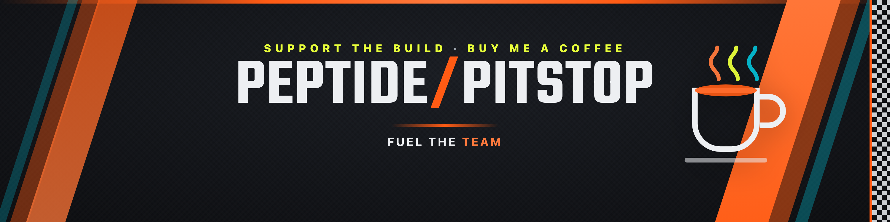

# Peptide Pitstop — Brand assets

Marketing / support-page artwork for Peptide Pitstop.

## Buy Me a Coffee cover

- **File:** `peptide-pitstop-bmc-cover.png` — 3000×750 px (4:1)
- **Source:** `bmc-cover.html`
- **Rebuild:** `./build-cover.sh` (fetches the Teko font, renders via headless Chrome)

Upload it on [buymeacoffee.com](https://buymeacoffee.com) → your page → *Edit* → **Cover image**.
The composition keeps essential text clear of the bottom-left, where BMC overlays the
profile avatar. The same 4:1 art doubles as a social/OG banner.

## Design tokens

Pulled straight from the app theme (`src/app/globals.css`). Motorsport "Pit Wall + Apex" look.

| Token            | Hex        | Use                          |
| ---------------- | ---------- | ---------------------------- |
| Carbon (base)    | `#0E0F12`  | Background                    |
| Ink              | `#EDEFF2`  | Primary text                 |
| Race-orange      | `#FF5B14`  | Primary fills / CTA          |
| Race-orange (lt) | `#FF7A3D`  | Gradient highlight           |
| Cyan             | `#00E5FF`  | Secondary data / accent      |
| Hi-viz yellow    | `#E8FF3A`  | Kicker / attention           |
| Redline          | `#FF4D4D`  | Danger (unused here)         |

**Display type:** [Teko](https://fonts.google.com/specimen/Teko) SemiBold, condensed caps.

## Licensing

- Artwork © the Peptide Pitstop project (see repo `LICENSE`).
- **Teko** font — [SIL Open Font License 1.1](https://openfontlicense.org). Fetched at build time
  by `build-cover.sh`; the binary is intentionally not committed (see `.gitignore`).
